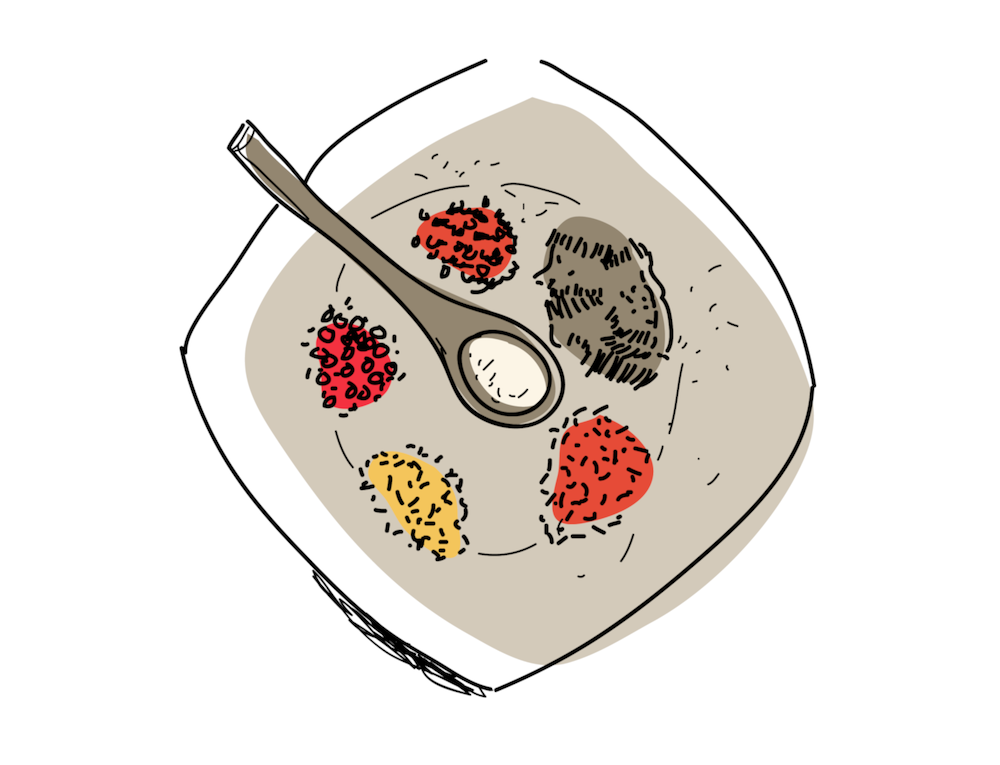

During the past lockdown-flavored holidays, I found myself needing to look up some of 
my recipes, which I usually store on my laptop. Find the laptop, open the laptop, bring 
the laptop to the kitchen. Those became standard steps for every recipe I didn't make
in a while. It became obvious that this is unpractical and surely there was a better 
way. I’m a Software Engineer after all, and I can totally make a website. The website
will also make it easier to share my recipes with everyone.

All my recipes were already written in [Markdown](https://en.wikipedia.org/wiki/Markdown),
and I wanted to keep them like that. I needed to find a project that will display my
markdown files in html. I’ve already worked with such projects using 
[Gatsby](https://www.gatsbyjs.com/) (React, JavaScript).

For this project, I wanted something simple and less JavaScript oriented. 


After a quick [DDG](https://duckduckgo.com/?q=open+source+cookbook) search, I found a great 
base project from [microsoft/DevCookbook](https://github.com/microsoft/DevCookbook).
The project is written in python and outputs static html files. Recipes are stored in Markdown,
and the design is clean with some nice looking illustrations.
Everything is served directly from GitHub repository.

I forked the original repository and cloned it locally. Unfortunately, the repository
doesn't come with Getting started guide, but it wasn't hard to figure out how to
install required libraries and compile files. The project is using
[Github Actions](https://github.com/features/actions) to compile the site, 
and everything is located in `.github/workflows/compile.yml`.

```bash
# Requires python 3.9
python -m pip install -r requirements.txt

# Transform .md -> .html
python compile.py
```

The script is looking for Markdown files inside `recipes` directory. 
Each recipe will be transformed into a separate html page using the recipe 
template located in `recipe_compailer/templates/recipe.html`.
All you have to do now is open files from `docs` directory in the browser,
and your cookbook will appear in front of you.

## Rendering recipes

All information about a recipe is located in a single Markdown file. This includes
page metadata, ingredients and instructions.

Originally, the project was rendering a simple list of ingredients, and instructions.
This felt too simple. Markdown allows us to format many more things, for example:
additional headers, nested lists, or even photos.
I extended the project to render anything that is defined after level 2 headers.
Everything following `## Ingredients` will be rendered in the left column,
and everything following `## Instructions` will be rendered in the right column.

Recipe metadata contains information about the author, his residence, recipe category,
and recipe quote. The recipe title is defined in the level 1 header. Page path is 
generated from title by converting it to 
[kebab-case](https://en.wikipedia.org/wiki/Naming_convention_(programming)#Multiple-word_identifiers).

**sample-recipe.md**
```markdown 
---
name: Martin Skec
residence: Berlin, Germany
category: dessert
quote: This apple flour combination is delicious
---

# This is a recipe title

## Ingredients
* 100g all purpose flour
* 1 apple
* 2 Tbsp. cold water

## Instructions

### Preparation
* Cut apple in slices

### Cooking
* Put flour in a bowl
* Stir together with cold water
```

## Publishing the site

Nowadays, you have plenty of options to host your website. You can self-host it on your 
own server. In most cases it's a few euros a month. For many years I use DigitalOcean, 
and they offer $100 over 60 days with this [referral link](https://m.do.co/c/c393b642df65).

You don't have to spend money on hosting. There are plenty of FREE options that are more
than good. Some have direct integration with your git repository. This means the
deployment is as easy as pushing a new commit. For example:
* [netlify](https://app.netlify.com/)
* [Vercel](https://vercel.com/)
* [GitHub Pages](https://pages.github.com/)

For this cookbook project, I opted for the simplest approach with GitHub Pages.
Everything is already connected with your repository and all you have to do is enable it 
in the repository settings. You can find detailed instructions at the link above.

## Conclusion

That's how I published my online cookbook. I plan to expand the project and add a few
more things like basic food categories, more recipe metadata, photos, etc.
For now, visit [https://cookbook.mskec.com](https://cookbook.mskec.com) and enjoy some
delicious recipes. Happy cooking!
