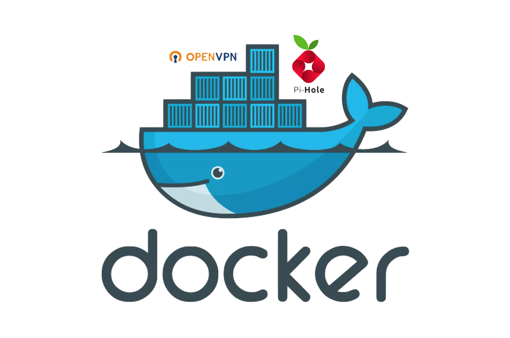

I am running my [OpenVPN](https://openvpn.net/) server for a few years now. 
It’s great when you have to connect to a sketchy public WiFi on a phone or a laptop.

For the past year on my home network 🏡 I am also running
[Pi-hole®](https://pi-hole.net/) “A black hole for Internet advertisements”.
It’s running on a RaspberryPi 2 and it’s successfully blocking almost all
annoying ads. The only downside is up-front work that needs to be done.
If your router does not support a custom DNS configuration, you need to set it
on each device separately. Another issue is that it will work only when I am
connected to my home network.

I wanted to have Pi-hole® even when I am outside. I have heard people using it
through a VPN, but it seemed like a lot of work to set up. 

I decided to give it a try. One lovely Berlin Sunday ☀️ I woke up early,
already at 7 am I was sipping morning espresso, while my droplet was spinning up.

In this post, you will find out what I learned that long day, staring at the
terminal errors and you learn how to quickly and easily start up your 
ad-blocking OpenVPN server.

---

## The goal
The goal of this tutorial is to show you how to configure docker-compose to run
your OpenVPN server with Pi-hole® DNS.

## Prerequisites
* I run the setup on Ubuntu 19.04 (Disco Dingo), but it should run on any
distribution that can run docker.
* Install docker https://docs.docker.com/install/linux/docker-ce/ubuntu/
* Install docker-compose https://docs.docker.com/compose/install/
* VPN Domain. In your domain DNS settings, make sure it points to your server (optional).

Create a directory where your configuration will live, eg.
```bash
mkdir /srv/pivpn
```

## Initialising OpenVPN
Before running everything in docker-compose, we need to initialize our OpenVPN
server. To persist configuration we will keep openvpn data in
`/srv/pivpn/etc-openvpn` and assign this directory to a docker container. 
Assign this path to a variable to make running commands easier.

```bash
OVPN_DATA="/srv/pivpn/etc-openvpn"
```

Run the command to generate the configuration. Replace `example.com` with your
domain. If you don’t have one, you can use the server IP address. We are also
specifying which DNS server should openvpn use with `-n 172.20.0.2`. This will
be a private IP address of pihole.

```bash
docker run \
  -v $OVPN_DATA:/etc/openvpn --log-driver=none --rm \
  kylemanna/openvpn \
  ovpn_genconfig -u udp://example.com -n 172.20.0.2
```

You will be asked for a CA passphrase to protect the private key. It’s
important to remember it because it’s later used to issue client certificates.

You will be prompt for **common name**, you can type your domain name.

```bash
docker run \
  -v $OVPN_DATA:/etc/openvpn --log-driver=none --rm -it \
  kylemanna/openvpn ovpn_initpki
```

That’s all, your openvpn configuration is now generated and can be found
in your directory of choice (`/srv/pivpn/etc-openvpn`). 

## docker-compose
Now we will write docker-compose file that will run our setup. Touch it 👇

```bash
touch /srv/pivpn/docker-compose.yml
```

We will have two services inside our docker-compose. The first is **openvpn**
and the second is **pihole**. Containers will be on the same network which we
will create later. The same network will allow openvpn container to use pihole
as a DNS server.

Use your preferred text editor (**vim FTW** 🎉)  and paste this configuration:

```docker
version: "3"

services:
  openvpn:     
     image: kylemanna/openvpn
     ports:
       - "1194:1194/udp"
     volumes:
       - ./etc-openvpn:/etc/openvpn
     cap_add:
       - NET_ADMIN
     restart: unless-stopped
     networks:
       vpn-network:
         ipv4_address: 172.20.0.3

  pihole:
    image: pihole/pihole
    ports:
      - "127.0.0.1:53:53/tcp"
      - "127.0.0.1:53:53/udp"
      # Uncomment port 80 if you want to have pihole UI
      # - "80:80/tcp"
      # - "443:443/tcp"
    environment:
      TZ: Europe/Berlin
      DNS1: 1.1.1.1
      DNS2: 1.0.0.1
      WEBPASSWORD: yourComplexPiHoleAdminUIpassword
    volumes:
       - ./etc-pihole:/etc/pihole
       - ./etc-dnsmasq.d:/etc/dnsmasq.d
    dns:
      - 127.0.0.1
      - 1.1.1.1
    cap_add:
      - NET_ADMIN
    restart: unless-stopped
    networks:
       vpn-network:
         ipv4_address: 172.20.0.2

networks:
  vpn-network:
    external: true
```

There is not much to configure with environment variables for openvpn. 

For pihole there are a few things you can configure:

You can configure timezone with `TZ` variable 
([All TZ values](https://en.wikipedia.org/wiki/List_of_tz_database_time_zones#List)).
You can set different DNS servers that pihole will use with `DNS1` and `DNS2` 
variables, in this configuration I’m using 
[Cloudflare DNS](https://blog.cloudflare.com/announcing-1111/).
You can set your own admin password for pihole admin UI.
If you want to have admin UI, uncomment ports 80 and 443 in `ports`.

Pihole is using volumes: `/srv/pivpn/etc-pihole` and `/srv/pivpn/etc-dnsmasq.d`
to store configuration and data which will allow us to update the container
and still have old data. Those directories will be created automatically on start.

Let’s now create a docker network for our containers. 

```bash
docker network create --driver=bridge \
  --subnet=172.20.0.0/24 --gateway=172.20.0.1 vpn-network
```

Before starting docker-compose, we need to do one more thing. Since pihole is
essentially a DNS server, we need to disable ubuntu DNS. 

⚠️ **Note:** Disabling ubuntu DNS means that if the pihole container is not running,
your domain resolution will not work.

Disable DNS with these commands:

```bash
systemctl stop systemd-resolved
systemctl disable systemd-resolved
```

Everything should be ready now 🤞 Start your docker-compose with:

```bash
docker-compose up
```

If it is successful, you will see pihole and openvpn containers printing their logs.

## Service that runs on startup
To make sure our VPN is up after a reboot, we will create Systemd service.
Create the following file in  `/etc/systemd/system/docker-pivpn.service`.

```bash
[Unit]
Description=Docker compose for OpenVPN server with pihole DNS
Requires=docker.service
After=docker.service

[Service]
Type=oneshot
ExecStart=/usr/local/bin/docker-compose --file /srv/pivpn/docker-compose.yml up -d
ExecStop=/usr/local/bin/docker-compose --file /srv/pivpn/docker-compose.yml down
RemainAfterExit=yes

[Install]
WantedBy=multi-user.target
```

After creating it, we need to enable it and reload the `systemd` process.

```bash
systemctl enable docker-pivpn.service
systemctl daemon-reload
```

Try to run the service.

```bash
systemctl start docker-pivpn.service
```

It should be running, to check it, run:

```bash
systemctl status docker-pivpn.service
```

Now reboot the server and check that it’s still running. 

```bash
reboot
```

## Create client config
We have OpenVPN server and Pi-hole running, but we still cannot connect to it
and verify that it’s truly working and blocking ads.

Let’s generate a client certificate and configuration.

Replace the `CLIENTNAME` with a descriptive name of the client that will use 
this certificate eg. `martin-phone`.

⚠️ **Note:** If you did a reboot, you will have to set `OVPN_DATA` variable again.

```bash
docker run \
  -v $OVPN_DATA:/etc/openvpn --log-driver=none --rm -it \
  kylemanna/openvpn \
  easyrsa build-client-full CLIENTNAME nopass
```

Generate client configuration with embedded certificates, replace `CLIENTNAME` 
like you did before.

```bash
docker run \
  -v $OVPN_DATA:/etc/openvpn --log-driver=none --rm \
  kylemanna/openvpn ovpn_getclient CLIENTNAME > CLIENTNAME.ovpn
```

Download the configuration to your laptop and add it to OpenVPN client and
test the connection. Visit your favorite news site and enjoy ad-free browsing.

### Clients

On macOS, I am using [Tunnelblick | Free open source OpenVPN VPN client server software for macOS](https://tunnelblick.net/).

On iOS, I am using the official [OpenVPN Connect app](https://apps.apple.com/us/app/openvpn-connect/id590379981).

On Android, you can use the official [OpenVPN Connect app](https://play.google.com/store/apps/details?id=net.openvpn.openvpn).

On Windows, you can use the official [OpenVPN Community app](https://openvpn.net/community-downloads/)

Install a client app of your choice, and load your configuration.

The easiest way to test if it’s working is to visit your favorite news-site 
or this website [https://ads-blocker.com/testing](https://ads-blocker.com/testing/)

## Conclusion
And that’s how you run OpenVPN and Pi-hole® inside docker.

Thank you for reading and I hope you now have your very own ad-blocking VPN server.

---

## Resources
* [GitHub - kylemanna/docker-openvpn: 🔒 OpenVPN server in a Docker container complete with an EasyRSA PKI CA](https://github.com/kylemanna/docker-openvpn)
* [GitHub - pi-hole/docker-pi-hole: Pi-hole in a docker container](https://github.com/pi-hole/docker-pi-hole)
* [How To Use Systemctl to Manage Systemd Services and Units | DigitalOcean](https://www.digitalocean.com/community/tutorials/how-to-use-systemctl-to-manage-systemd-services-and-units)

☁️ Try out [DigitalOcean – The developer cloud](https://m.do.co/c/c393b642df65) 
with this referral link. You will get $100 in credit over 60 days.
It's perfect to try setting up your very own ad-blocking VPN server. 
